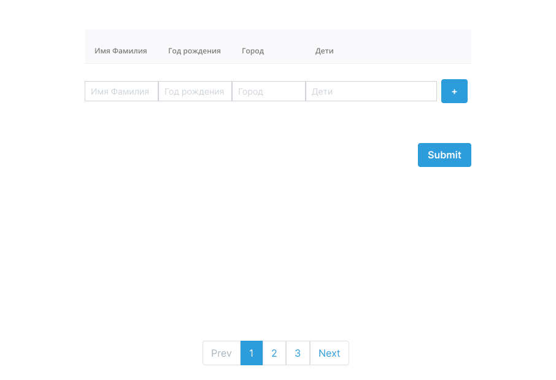
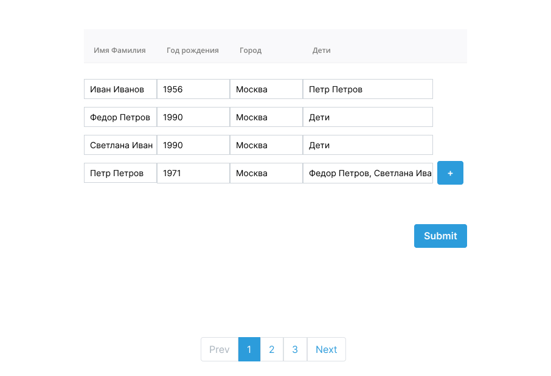
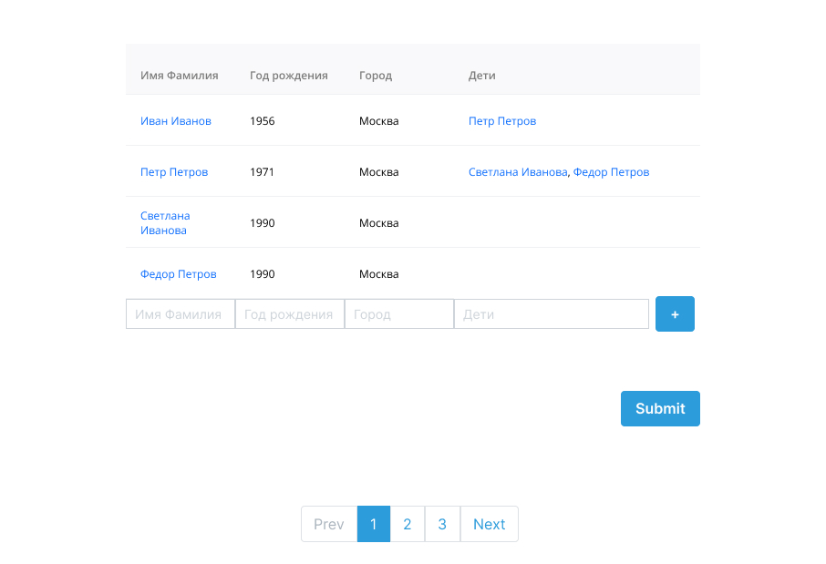
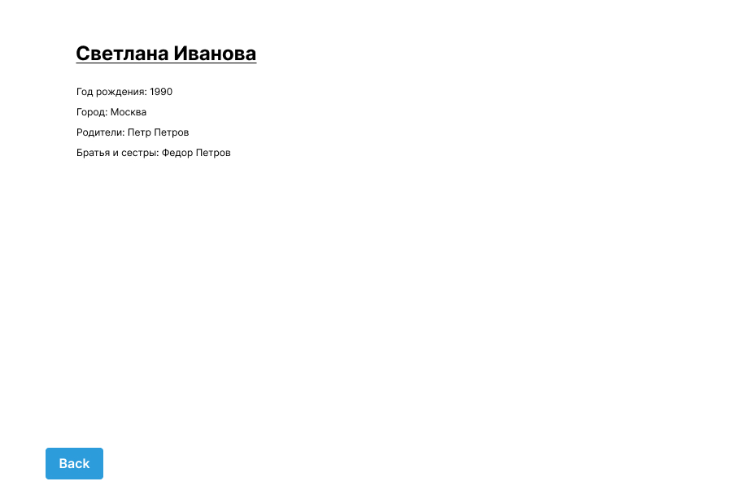

# Тестовое задание для веб-разработчика Angular

## Описание

Нужно сделать таблицу с данными о пользователях. В таблице должно быть имя пользователя, дата рождения, город и список детей.

## Задача

1. Реализуйте компонент с таблицей. Последней строкой в таблице должна быть строка с инпутами и кнопкой `+`. При нажатии на эту кнопку должна добавляться новая строка с инпутами.

2. Пользователь может вводить любое количество строк. После того, как пользователь вводит данные, он нажимает `Submit`. Реализуйте обработку сабмита. Запрос на добавление пользователя `POST http://localhost:3000/person`.

3. Продумайте как реализовать связи между объектами. Если пользователь вводит в поле "дети" уже добавленного в таблицу персонажа, то должна образоваться связь с тем объектом. Если пользователь вводит в поле "дети" еще недобавленное имя, но персонаж с таким именем указывается среди добавляемых, то между ними так же должна образоваться связь. Иными словами связь "предок"-"потомок" должна образовываться как между добавленными, так и между новыми(добавляемыми) сущностями. Определять связь достаточно по имени и фамилии. Если пользователь с таким именем и фамилией не добавлен и не добавляется в текущем сабмите, то такой потомок игнорируется(не записывается). Потомки указываются через запятую. Запрос на обновление пользователя `PUT http://localhost:3000/:id`

4. Каждое имя в таблице(включа столбец "Дети") - это ссылка которая ведет на страницу персонажа с таким именем. На этой странице отображаются данные о персонаже, родители и дети персонажа(см. скрин).

5. Продумайте отображение о статусе добавления: спиннер или хотя бы блокировку кнопки пока запрос отправляется. Если запрос упал с ошибкой, то на форме должен отобразиться текст с ошибкой.
6. Можете использовать стили бутстрапа.
7. Используйте данный репозиторий в качестве шаблона, внесите в него свои правки и запушьте в свой репозиторий.
8.  Будет плюсом, если задеплоите куда-нибудь готовый проект, например на [https://www.heroku.com/](https://www.heroku.com/) или [https://vercel.com/](https://vercel.com/) и добавите ссылку в `README.md` своего репозитория.

## Советы
- ознакомьтесь с серверным кодом, посмотрите какие роуты есть и что они возвращают
- добавление персонажей осуществляется одиночными запросами. Не пытайтесь добавлять их одним запросом(несмотря на то, что это возможно). Код сервера лишь имитирует работу. Старайтесь не нарушать семантику `REST`